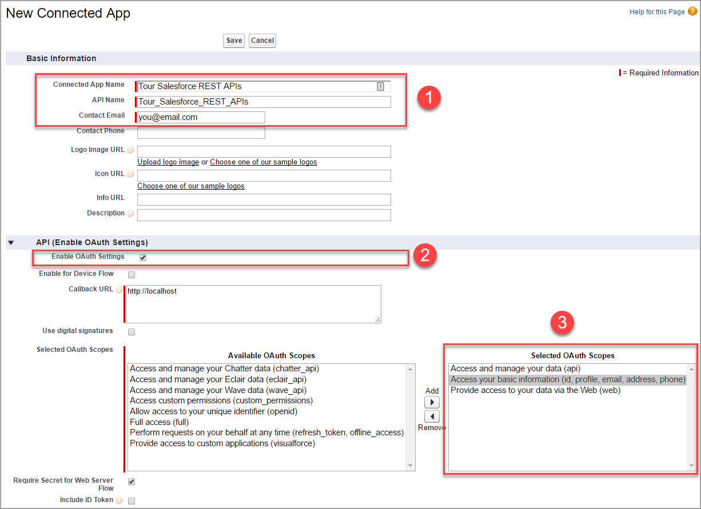

# Tour of Salesforce REST APIs for Multiple DML in Single Request

http://midwestdreamin.com/

In this session, I introduce you to three different Salesforce REST APIs designed specifically
to perform multiple DML to different objects and handle complex data structures in a single request.
See real code and live demos of **Apex REST Services**, **Composite API**, and **SObject Tree API**.
Avoid troublesome rollback scenarios and burning through API requests of traditional development
and learn to design efficient, robust integrations with the Salesforce REST API.


About the Speaker
-----------------

Ironically, Doug Ayers’ first job out of college was to migrate a company from Salesforce to an in-house CRM.
Since then he’s built an accomplished career on leading teams to adopt and run their businesses on the Salesforce platform.
Doug is a Salesforce MVP, Nashville Developer Group Leader, Dreamforce speaker, RAD Women Apex Coach, and impassioned teacher.
Doug holds the prestigious System Architect, Application Architect, and Platform Developer II certifications, for a total of 13 Salesforce certifications.
By day he is a Senior Developer at GearsCRM, architecting robust Apex, Visualforce, and Lightning solutions for customers.
By night he can be found blogging about his Salesforce exploits at https://douglascayers.com.


Getting Started
---------------

1. Install [NodeJS](https://nodejs.org). I used v8.1.0 on Windows (x64)
2. Create a [connected app](https://help.salesforce.com/articleView?id=connected_app_create.htm&type=0&language=en_US) in your Salesforce developer org

  (a) Provide **Connected App Name**

  (b) Provide **Contact Email**

  (c) Select **Enable OAuth Settings**

  (d) Select **OAuth Scopes** (id, api, web)




3. Clone this project
```
git clone https://github.com/DouglasCAyers/sfdc-rest-apis-for-multiple-dml.git
cd sfdc-rest-apis-for-multiple-dml
```
4. In the project folder, create a file named `.env` that includes the following properties:
```
SFDC_CLIENT_KEY=your connected app consumer key
SFDC_CLIENT_SECRET=your connected app consumer secret
SFDC_PASSWORD=your salesforce password
SFDC_TOKEN=your salesforce token
SFDC_USERNAME=your salesforce username
SFDC_API_VERSION=40.0
```
5. Create the apex class `/src/classes/MyApexRestService.cls` in your Salesforce developer org
6. Install dependencies from command line via `npm install` (this creates a **node_modules** directory)
7. Run the app locally from command line via `node app.js`
8. In your browser go to http://localhost:8080/


Usage
-----

The web app has tabs that demonstrate API behavior. Here is description and purpose of each:


| Tab | Description |
|---|---|
| Home | Display speaker and sponsor information |
| Traditional | Making multiple API requests to create records. If the 2nd request were to fail there is no clean way to rollback the 1st request. |
| Custom Apex | Overcomes multiple API requests by exposing a custom endpoint. The transaction and rollback logic are in the apex class. |
| Composite | No need for custom apex code, also overcomes multiple API requests by using Composite API that bundles the requests together in an "all or none" fashion. |
| SObject Tree | Specialized variant of the Composite API for creating a record and related list records in a single API call and transaction. |
| PepUp Tech | PepUp Tech.org, non-profit highlighted at Midwest Dreamin 2017 |
